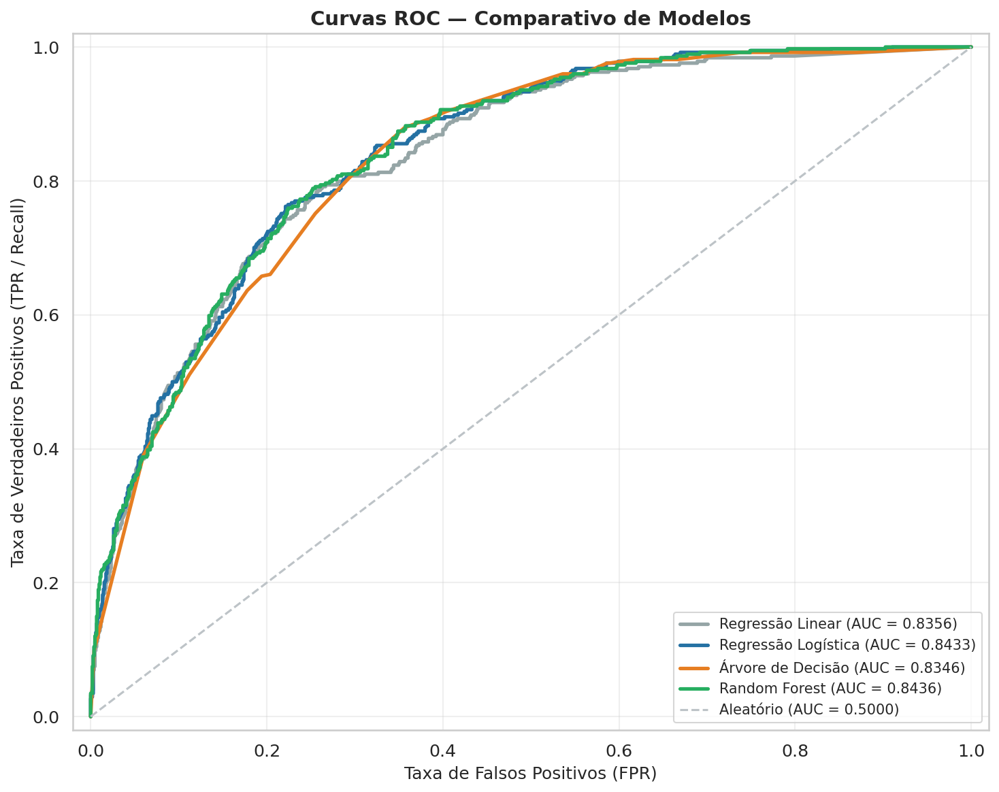
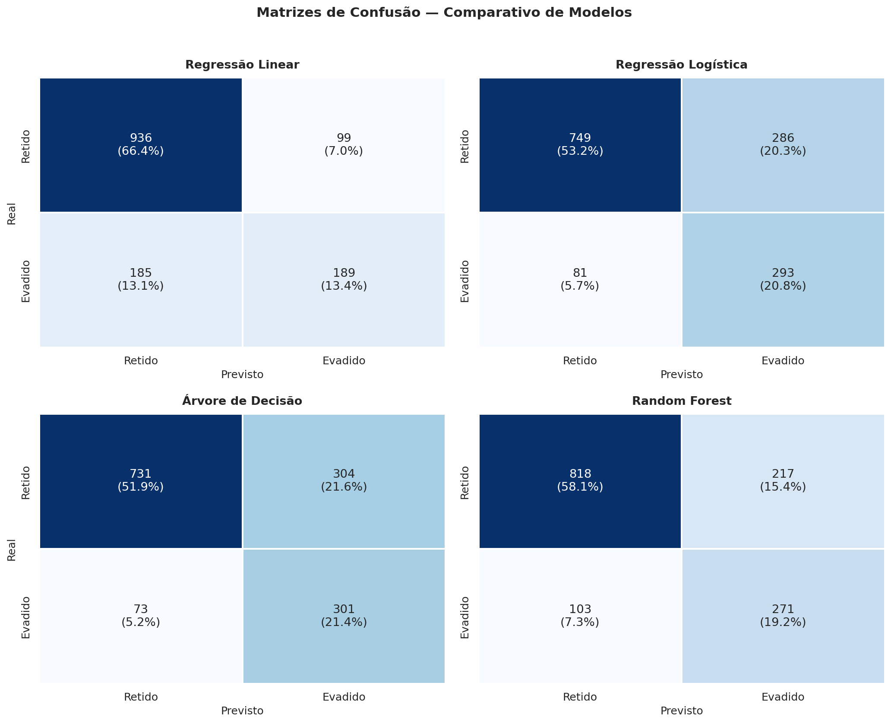
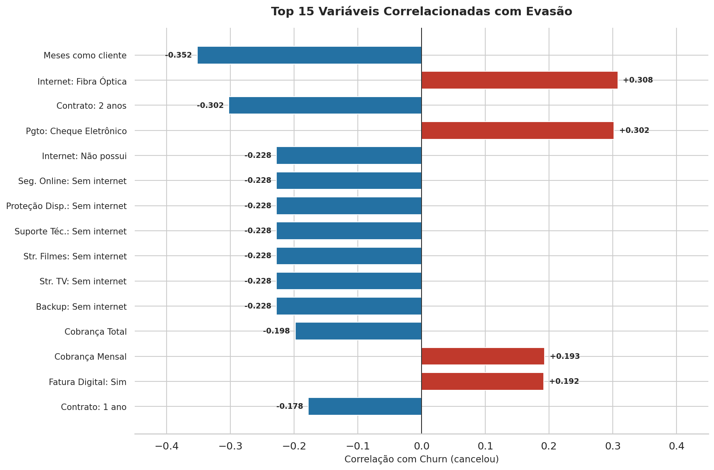
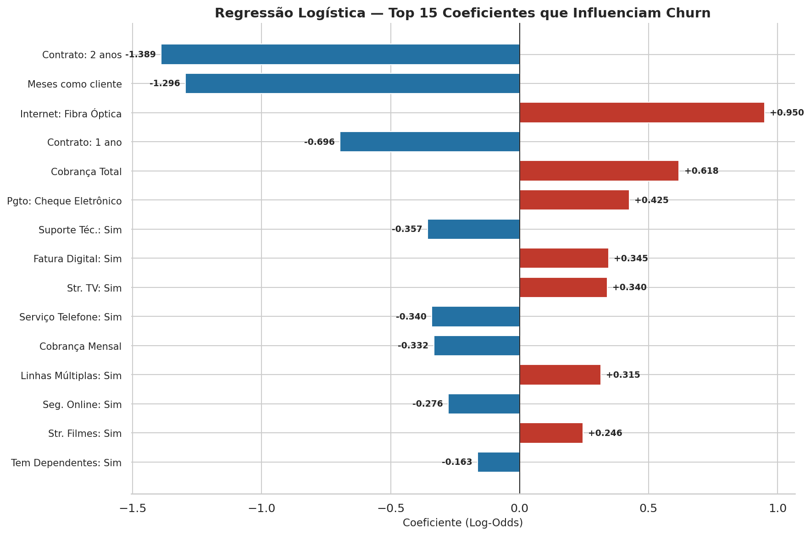
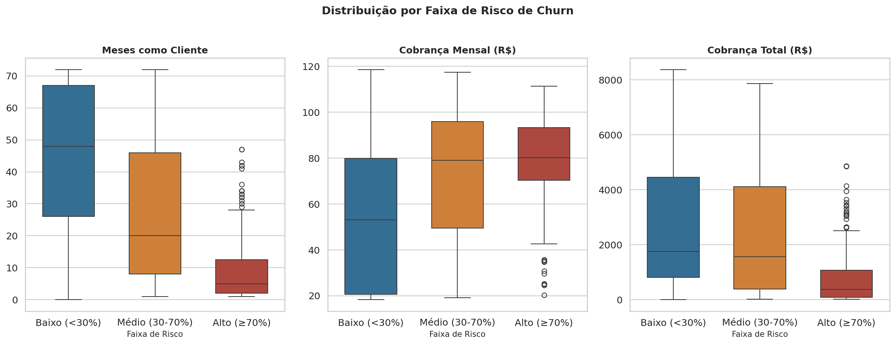
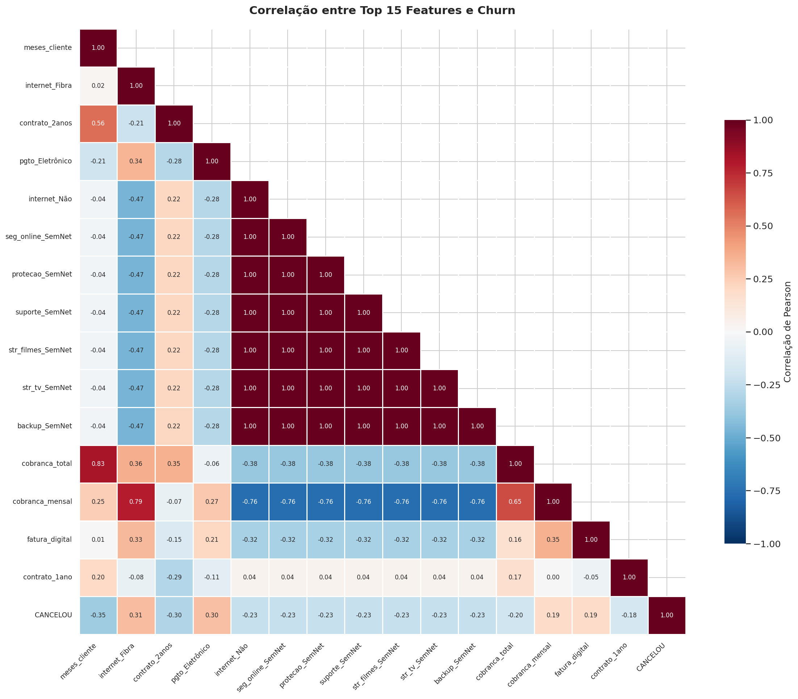

# 📊 TelecomX — Previsão de Evasão de Clientes com Machine Learning

### 🎓 Projeto Final | Formação Data Science — Alura + Oracle Next Education (ONE)

---

[](https://colab.research.google.com/github/thedrads/telecomx-churn-prediction/blob/main/notebooks/telecomx_churn_modelagem.ipynb)

[](https://www.python.org/)
[](https://scikit-learn.org/)
[](https://pandas.pydata.org/)
[](https://jupyter.org/)
[](LICENSE)
[]()

> **Pipeline completo de Machine Learning** para previsão de churn da TelecomX: pré-processamento, modelagem preditiva (Regressão Linear, Regressão Logística, Árvore de Decisão e Random Forest), avaliação de métricas e identificação de clientes de alto risco. Parte 2 do [Challenge Telecom X — Análise Exploratória](https://github.com/thedrads/telecomx-churn-analysis).

---

## 📑 Sumário

- [Sobre o Projeto](#-sobre-o-projeto)
- [Contexto e Motivação](#-contexto-e-motivação)
- [Principais Resultados](#-principais-resultados)
- [Pipeline de Machine Learning](#-pipeline-de-machine-learning)
- [Modelos e Desempenho](#-modelos-e-desempenho)
- [Variáveis que Mais Influenciam a Evasão](#-variáveis-que-mais-influenciam-a-evasão)
- [Perfil do Cliente de Alto Risco](#-perfil-do-cliente-de-alto-risco)
- [Recomendações de Retenção](#-recomendações-de-retenção)
- [Visualizações](#-visualizações)
- [Estrutura do Repositório](#-estrutura-do-repositório)
- [Tecnologias Utilizadas](#-tecnologias-utilizadas)
- [Como Executar](#-como-executar)
- [Dataset](#-dataset)
- [Projeto Relacionado](#-projeto-relacionado)
- [Declaração de Uso de IA](#-declaração-de-uso-de-ia)
- [Autor](#-autor)
- [Licença](#-licença)

---

## 🎯 Sobre o Projeto

Este repositório contém a **Parte 2** do Challenge Data Science da [Alura](https://www.alura.com.br/) em parceria com o programa [Oracle Next Education (ONE)](https://www.oracle.com/br/education/oracle-next-education/) — o projeto final da formação em Data Science.

Enquanto a [Parte 1](https://github.com/thedrads/telecomx-churn-analysis) focou em ETL e Análise Exploratória, esta etapa aplica técnicas de **Machine Learning supervisionado** para construir modelos preditivos capazes de:

1. **Prever** quais clientes têm maior probabilidade de cancelar o serviço.
2. **Identificar** as variáveis que mais influenciam a decisão de evasão.
3. **Traçar o perfil** do cliente de alto risco para direcionar ações de retenção.

### O Problema de Negócio

A TelecomX possui uma taxa de churn de **26,5%** — aproximadamente 1 em cada 4 clientes cancela o serviço. Com uma base de 7.043 clientes analisados e 1.869 evasões, o custo de não agir é significativo: em telecomunicações, adquirir um novo cliente custa de 5x a 25x mais do que reter um existente.

---

## 🚀 Contexto e Motivação

Sou gestor financeiro com 20 anos de experiência em gestão empresarial, em transição de carreira para Data Science e Cloud Computing. Este projeto faz parte da minha formação no programa **Oracle Next Education (ONE)** e complementa o **MBA em IA & Análise de Dados (SENAC)**.

O objetivo foi aplicar, em um cenário realista de negócios, as metodologias de Machine Learning aprendidas na formação: Estatística com Python, Regressão Linear, Classificação com Scikit-learn e validação de métricas. A combinação da minha experiência em gestão financeira com as técnicas de Data Science permitiu gerar insights que conectam dados a decisões de negócio.

---

## 📈 Principais Resultados

| Métrica | Valor |
|---------|-------|
| **Melhor AUC-ROC** | 0,8436 (Random Forest) |
| **Melhor Recall (Evadido)** | 80,5% (Árvore de Decisão) |
| **Clientes de alto risco identificados** | 267 (18,9% do teste) |
| **Precisão no grupo de alto risco** | 64,8% realmente cancelaram |
| **Principal fator de evasão** | Contrato mensal + Fibra Óptica + Cheque Eletrônico |

### Descobertas-Chave

- **Tempo de relacionamento** é o fator com maior correlação negativa com churn (−0,352): quanto mais tempo como cliente, menor a chance de cancelar.
- **Internet por Fibra Óptica** é o maior fator de risco positivo (+0,308), sugerindo insatisfação com o serviço ou preço.
- **Contrato de 2 anos** reduz drasticamente o churn (−0,302), enquanto **contrato mensal** concentra a maior parte das evasões.
- **Pagamento por Cheque Eletrônico** tem correlação de +0,302 com churn — clientes com débito automático são mais fiéis.

---

## 🔬 Pipeline de Machine Learning

O projeto segue um pipeline estruturado de ML, alinhado às fases do framework CRISP-DM:

```
Dados Tratados (Parte 1)
        │
        ▼
┌─────────────────────────┐
│  PRÉ-PROCESSAMENTO      │
│  • Encoding (One-Hot)    │
│  • Normalização (Z-score)│
│  • Análise de correlação │
└───────────┬─────────────┘
            │
            ▼
┌─────────────────────────┐
│  SEPARAÇÃO DOS DADOS     │
│  • 80% Treino / 20% Teste│
│  • Estratificação        │
│  • Validação de proporção│
└───────────┬─────────────┘
            │
            ▼
┌─────────────────────────┐
│  MODELAGEM               │
│  • Regressão Linear      │
│  • Regressão Logística   │
│  • Árvore de Decisão     │
│  • Random Forest         │
└───────────┬─────────────┘
            │
            ▼
┌─────────────────────────┐
│  AVALIAÇÃO               │
│  • AUC-ROC / Acurácia    │
│  • Recall / Precision    │
│  • Matrizes de Confusão  │
│  • Curvas ROC            │
└───────────┬─────────────┘
            │
            ▼
┌─────────────────────────┐
│  INSIGHTS DE NEGÓCIO     │
│  • Perfil de risco       │
│  • Ranking de clientes   │
│  • Recomendações         │
└─────────────────────────┘
```

### Decisões Técnicas

| Etapa | Escolha | Justificativa |
|-------|---------|---------------|
| **Encoding** | One-Hot (drop_first) | Variáveis nominais sem ordem intrínseca; evita multicolinearidade |
| **Normalização** | StandardScaler (Z-score) | Mais robusto a outliers que MinMaxScaler; padrão para modelos lineares |
| **Split** | 80/20 com estratificação | Preserva a proporção de churn (26,5%) em treino e teste |
| **Desbalanceamento** | class_weight='balanced' | Penaliza mais erros na classe minoritária (churn) |

---

## 🏆 Modelos e Desempenho

| Modelo | Acurácia | AUC-ROC | Recall (Evadido) | Observação |
|--------|----------|---------|-------------------|------------|
| **Random Forest** | 0,7729 | **0,8436** | 0,7246 | Melhor equilíbrio geral |
| **Regressão Logística** | 0,7395 | 0,8433 | 0,7834 | Melhor interpretabilidade |
| **Regressão Linear** | 0,7984 | 0,8356 | 0,5053 | Limitações para classificação binária |
| **Árvore de Decisão** | 0,7324 | 0,8346 | **0,8048** | Maior detecção de churns |

### Curvas ROC — Comparativo

<p align="center">
  
</p>

O **Random Forest** obteve o melhor AUC-ROC (0,8436), indicando a maior capacidade de discriminação entre clientes que cancelam e clientes que permanecem. A **Regressão Logística** ficou muito próxima (0,8433) e oferece a vantagem de coeficientes diretamente interpretáveis.

A **Regressão Linear** foi incluída intencionalmente como modelo exploratório para demonstrar suas limitações em classificação binária: 15,1% das predições ficaram fora do intervalo [0, 1].

### Matrizes de Confusão

<p align="center">
  
</p>

---

## 📊 Variáveis que Mais Influenciam a Evasão

A análise convergente de dois métodos — coeficientes da Regressão Logística e importância de features do Random Forest — revelou as variáveis mais influentes:

### Correlação com Churn

<p align="center">
  
</p>

### Coeficientes da Regressão Logística

<p align="center">
  
</p>

### Importância de Features — Random Forest

<p align="center">
  
</p>

**Fatores que aumentam o risco de churn:** Internet por Fibra Óptica, pagamento por Cheque Eletrônico, fatura digital ativa e cobrança mensal elevada.

**Fatores que reduzem o risco de churn:** Contratos de longa duração (1 ou 2 anos), maior tempo como cliente e serviços adicionais contratados (suporte técnico, segurança online, backup).

---

## 🎯 Perfil do Cliente de Alto Risco

O modelo de Random Forest identificou **267 clientes** com probabilidade de churn ≥ 70%. O perfil predominante nesse grupo:

| Característica | Perfil de Alto Risco | Perfil de Baixo Risco |
|----------------|----------------------|-----------------------|
| **Tempo como cliente** | ~9 meses | ~45 meses |
| **Tipo de contrato** | Mensal (Month-to-month) | Bianual (Two year) |
| **Tipo de internet** | Fibra Óptica | Sem internet ou DSL |
| **Método de pagamento** | Cheque Eletrônico | Cartão de Crédito (automático) |
| **Cobrança mensal média** | US$ 77,76 | US$ 52,73 |
| **Fatura digital** | Sim | Não |
| **Taxa real de churn** | 64,8% | Baixa |

### Distribuição por Faixa de Risco

<p align="center">
  
</p>

### Mapa de Calor — Correlação entre Features e Churn

<p align="center">
  
</p>

---

## 💡 Recomendações de Retenção

Com base nos resultados dos modelos e na análise de perfil, as ações recomendadas para reduzir a evasão são:

1. **Incentivar contratos de longa duração** — oferecer descontos progressivos para migração de contrato mensal para anual/bianual, especialmente nos primeiros 12 meses de relacionamento.

2. **Investigar o serviço de Fibra Óptica** — a forte correlação com churn (+0,308) sugere insatisfação com qualidade ou preço. Uma auditoria de satisfação nesse segmento é prioritária.

3. **Promover serviços adicionais como fator de retenção** — clientes sem suporte técnico, segurança online ou backup apresentam maior evasão. Pacotes com esses serviços podem aumentar a aderência.

4. **Monitorar clientes novos com pagamento por cheque eletrônico** — este é o grupo de maior risco. Ações proativas de onboarding e migração para débito automático reduzem o churn.

5. **Revisar a experiência da fatura digital** — a correlação positiva com churn pode indicar problemas de usabilidade ou falta de transparência na cobrança.

---

## 📁 Estrutura do Repositório

```
telecomx-churn-prediction/
│
├── assets/
│   └── images/                          # Gráficos e visualizações
│       ├── heatmap_correlacao_churn.png
│       ├── ranking_correlacao_churn.png
│       ├── matrizes_confusao.png
│       ├── curvas_roc.png
│       ├── coeficientes_logistica.png
│       ├── importancia_random_forest.png
│       └── boxplot_faixas_risco.png
│
├── data/
│   └── processed/                       # Dados tratados
│       └── dados_tratados.csv
│
├── notebooks/
│   └── telecomx_churn_modelagem.ipynb   # Notebook principal
│
├── .gitignore
├── LICENSE                              # Licença MIT
├── README.md                            # Este arquivo
└── requirements.txt                     # Dependências do projeto
```

---

## 🧰 Tecnologias Utilizadas

| Categoria | Tecnologia | Versão | Uso no Projeto |
|-----------|------------|--------|----------------|
| **Linguagem** | Python | 3.10+ | Base do pipeline |
| **Dados** | Pandas | 2.0+ | Manipulação e análise |
| **Dados** | NumPy | 1.24+ | Operações numéricas |
| **ML** | Scikit-learn | 1.3+ | Modelos, métricas e pré-processamento |
| **Visualização** | Matplotlib | 3.7+ | Gráficos estáticos |
| **Visualização** | Seaborn | 0.12+ | Visualização estatística |
| **Ambiente** | Google Colab | — | Execução do notebook |
| **Versionamento** | Git/GitHub | — | Controle de versão |

---

## 🚀 Como Executar

### Opção Rápida: Google Colab

[](https://colab.research.google.com/github/thedrads/telecomx-churn-prediction/blob/main/notebooks/telecomx_churn_modelagem.ipynb)

1. Clique no badge acima para abrir o notebook diretamente no Google Colab.
2. Faça upload do arquivo `dados_tratados.csv` (disponível em `data/processed/`).
3. Execute as células sequencialmente.

### Execução Local

**Pré-requisitos:** Python 3.10+ e pip.

1. **Clone o repositório**
   ```bash
   git clone https://github.com/thedrads/telecomx-churn-prediction.git
   cd telecomx-churn-prediction
   ```

2. **Crie um ambiente virtual** (recomendado)
   ```bash
   python -m venv venv
   source venv/bin/activate  # Linux/Mac
   venv\Scripts\activate     # Windows
   ```

3. **Instale as dependências**
   ```bash
   pip install -r requirements.txt
   ```

4. **Execute o notebook**
   ```bash
   jupyter notebook notebooks/telecomx_churn_modelagem.ipynb
   ```

---

## 📋 Dataset

| Informação | Detalhe |
|------------|---------|
| **Origem** | Gerado na [Parte 1 — Análise Exploratória](https://github.com/thedrads/telecomx-churn-analysis) |
| **Arquivo** | `dados_tratados.csv` |
| **Registros** | 7.043 clientes |
| **Variáveis** | 21 (20 features + 1 target) |
| **Target** | `cancelou` (Yes/No → 1/0) |
| **Distribuição** | 73,5% retidos / 26,5% evadidos |

### Dicionário de Dados

| Variável | Tipo | Descrição |
|----------|------|-----------|
| `id_cliente` | object | Identificador único do cliente |
| `cancelou` | object → int | Variável-alvo: 1 = evadido, 0 = retido |
| `genero` | object | Masculino / Feminino |
| `idoso` | int | Cliente idoso (1) ou não (0) |
| `tem_parceiro` | object | Possui parceiro (Yes/No) |
| `tem_dependentes` | object | Possui dependentes (Yes/No) |
| `meses_cliente` | int | Tempo como cliente em meses |
| `servico_telefone` | object | Possui serviço telefônico (Yes/No) |
| `linhas_multiplas` | object | Múltiplas linhas telefônicas |
| `tipo_internet` | object | DSL / Fiber optic / No |
| `seguranca_online` | object | Segurança online contratada |
| `backup_online` | object | Backup online contratado |
| `protecao_dispositivo` | object | Proteção de dispositivo contratada |
| `suporte_tecnico` | object | Suporte técnico contratado |
| `streaming_tv` | object | Streaming de TV contratado |
| `streaming_filmes` | object | Streaming de filmes contratado |
| `tipo_contrato` | object | Mensal / Anual / Bianual |
| `fatura_digital` | object | Fatura digital (Yes/No) |
| `metodo_pagamento` | object | Método de pagamento |
| `cobranca_mensal` | float | Valor da cobrança mensal (USD) |
| `cobranca_total` | float | Valor total cobrado (USD) |

---

## 🔗 Projeto Relacionado

Este repositório é a **Parte 2** do Challenge Telecom X. A Parte 1, focada em ETL e Análise Exploratória, está disponível em:

📂 [**telecomx-churn-analysis**](https://github.com/thedrads/telecomx-churn-analysis) — Extração via API, limpeza de dados, análise exploratória e preparação do dataset para Machine Learning.

---

## 🤖 Declaração de Uso de IA

Este projeto foi desenvolvido com assistência de **Inteligência Artificial Generativa**.

### Escopo de Utilização

- Estruturação e organização do código seguindo PEP 8 e PEP 257
- Revisão de boas práticas em Data Science e Machine Learning
- Sugestões de formatação, documentação e visualizações
- Assistência na análise metodológica e interpretação de resultados

### Responsabilidade

Todo o conteúdo final — códigos, análises, insights, decisões técnicas e conclusões — foi **integralmente revisado, validado e aprovado pelo autor**. A IA foi utilizada como ferramenta de apoio ao desenvolvimento, complementando o trabalho intelectual, não o substituindo.

### Referências sobre Disclosure de IA

- [Princeton University - Disclosing the Use of AI](https://libguides.princeton.edu/generativeAI/disclosure)
- [Arizona State University - Acknowledging AI Usage](https://libguides.asu.edu/generativeai/acknowledgement)
- [AID Framework - AI Disclosure](https://crln.acrl.org/index.php/crlnews/article/view/26548)

> Este projeto está alinhado à minha formação contínua em IA aplicada aos negócios, incluindo cursos como [IA Aplicada aos Negócios – FGV](https://educacao-executiva.fgv.br/cursos/live/curta-media-duracao-live/inteligencia-artificial-aplicada-aos-negocios-2) e [Generative AI for Productivity – Cornell](https://ecornell.cornell.edu/certificates/technology/generative-ai-for-productivity/).

---

## 👤 Autor

<table>
  <tr>
    <td align="center">
      <a href="https://github.com/thedrads">
        <br>
        <sub><b>Fábio Andrade</b></sub>
      </a>
    </td>
  </tr>
</table>

[](https://www.linkedin.com/in/fabioandradegf/)
[](https://github.com/thedrads)

---

## 📄 Licença

Este projeto está sob a licença MIT — consulte [LICENSE](LICENSE) para detalhes.

---

<p align="center">
  Desenvolvido por <a href="https://github.com/thedrads">Fábio Andrade</a> | Aberto a feedbacks e contribuições
</p>
